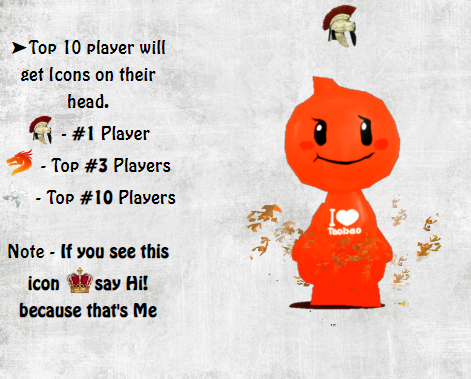

# #OSUM Server Site
This site was hosted for #OSUM Server [BombSquad Multiplatform Game](https://www.froemling.net/apps/bombsquad) v1.4.XX and Older. 
Hosted on Apache2 in Ubuntu Cloud machine.
[Preview Available Here!](https://sobydamn.github.io/osum-server-site/)
 

[Server Files](https://github.com/SobyDamn/BombSquad-Server-Files-OSUM-Server) are available here v1.4.XX and Older.
## Features
### Players' Ranking
This site shows the top 500 Bombsquad players who played in #OSUM server and all players' data stored in _stats.json_ file.
The top #10 players get a different look(an Icon on head) 

 

### Chatlogs and Chatfilter
The python file for chatfilter can be found in [Server Files](https://github.com/SobyDamn/BombSquad-Server-Files-OSUM-Server) v1.4.XX and Older. 
The chatfilter can be used to block any message containing the blacklisted word and store the id in blacklisted list to later helping in banning the player.
Storing data related to chats like Message and timing of message with player name and his game id. [Preview Here!](https://sobydamn.github.io/osum-server-site/chats/Chats%202019-09-18.html)

>Server Files might not be compatible with the latest version 1.5.xx
